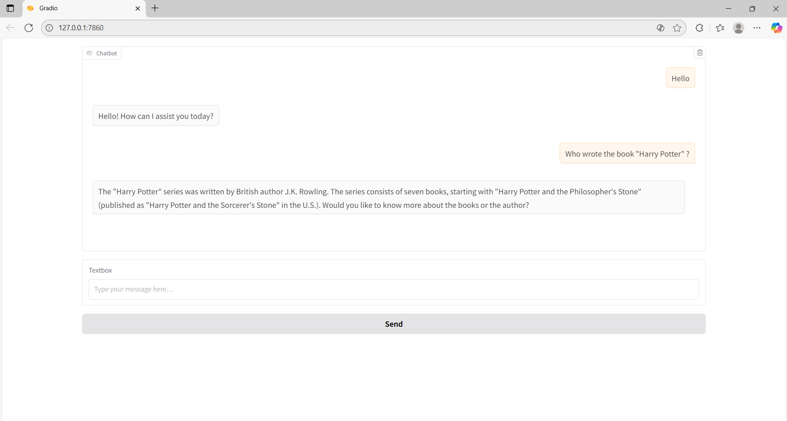

# AI ChatBot like ChatGPT

A simple AI-powered chat application inspired by ChatGPT. This app allows users to converse with an AI assistant that is: 
Helpful 
Creative 
Clever 
Friendly 

Technologies Used:
The app is built with Python, Gradio, and OpenAI’s GPT API, providing a smooth and interactive chat experience directly in the browser.

Functional Requirements:
Real-time AI chat in the browser
Maintains conversation history
Easy to run locally with your OpenAI API key

Usage:
Install dependencies; pip install openai gradio matplotlib
Set your OpenAI API key
Run the app; python gpt-app.py
Open the browser and start chatting
